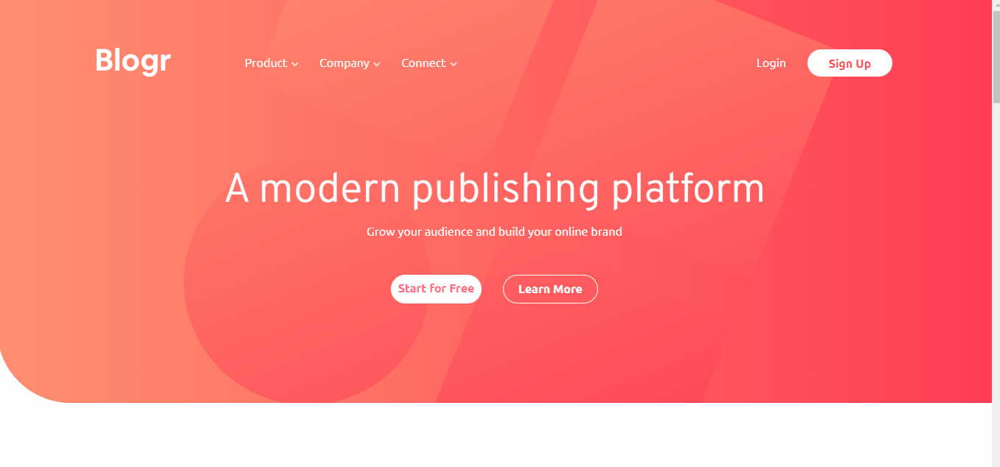

# Desafio Blogr Landing Page - Frontend-Mentor

Este é um desafio de uma Landing Page para a Blogr, proposto pelo site Frontend-Mentor.

## Tabela de Conteúdos

- [Visão Geral](#visão-geral)
    - [Imagens](#imagens)
    - [Link da página](#link)
- [Processo](#processo)
    - [Linguagens utilizadas](#linguagens-utilizadas)
    - [O que aprendi](#o-que-aprendi)
    - [Possíveis evoluções](#possíveis-evoluções)
- [Autor](#autor)

## Visão-geral

### Imagens

<br>

````
Versão de Desktop
````

   

<br>

````
Versão Mobile
````

 

### Link

- Página no GitHub Pages: <a href="https://julio-mansan2.github.io/blogr-landing-page/">Clique aqui!</a>

## Processo

### Linguagens utilizadas

<br>

- Marcações semânticas de HTML5
- Propriedades de customização do CSS3
- Estruturas de JavaScript

<br>

### O que aprendi

<br>

- Criar uma navegação em "dropdown" utilizando JS:

````javascript

var acc = document.getElementsByClassName("acordeon");
var i;

for (i = 0; i < acc.length; i++) {
  acc[i].addEventListener("click", function() {
    this.classList.toggle("active");
    var panel = this.nextElementSibling;
    if (panel.style.maxHeight) {
      panel.style.maxHeight = null;
    } else {
      panel.style.maxHeight = panel.scrollHeight + "px";
    } 
  });
}

````

- Criar um menu hambúrguer:

````html

<input id="menu__toggle" type="checkbox" />
<label class="menu__btn" for="menu__toggle">
<span></span>
</label>

````
````css

    #menu__toggle {
        opacity: 0;
    }

    #menu__toggle:checked+.menu__btn>span {
        transform: rotate(45deg);
    }

    #menu__toggle:checked+.menu__btn>span::before {
        top: 0;
        transform: rotate(0deg);
    }

    #menu__toggle:checked+.menu__btn>span::after {
        top: 0;
        transform: rotate(90deg);
    }

    .menu__btn {
        top: 1.8rem;
        right: 7%;
        position: absolute;
        width: 2rem;
        height: 1rem;
        cursor: pointer;
        z-index: 1;
    }

    .menu__btn>span,
    .menu__btn>span::before,
    .menu__btn>span::after {
        display: block;
        position: absolute;
        width: 100%;
        height: 2px;
        background-color: var(--white);
        transition-duration: .25s;
    }

    .menu__btn>span::before {
        content: '';
        top: -8px;
    }

    .menu__btn>span::after {
        content: '';
        top: 8px;
    }

    .header .menu__box {
        position: absolute;
        top: 130%;
        width: 30%;
        height: fit-content;
        gap: 1.25rem;
        gap: 1.8rem;
        background-color: var(--white);
        left: -100%;
        padding: 1.8rem;
        align-items: center;
        flex-direction: column;
        background-size: contain;
        transition-duration: .25s;
        border-radius: 10px;
        text-align: center;
        z-index: 2;
    }

    .header .login-area {
        position: relative;
        flex-direction: column;
    }

    .header .menu__box div {
        flex-direction: column;
    }

    .header .acordeon {
        color: var(--very-dark-black-blue);
        margin-bottom: 0.6rem;
    }

    .header .acordeon::after {
        content: url(../images/icon-arrow-dark.svg);
    }


````
<br>

### Possíveis evoluções

<br>

- Códigos mais compactos;
- Conhecer de forma correta as funções disponíveis para elementos ```:after```.

<br>

## Autor

GitHub - <a href="https://github.com/julio-mansan2">julio-mansan2</a> <br>
Front-end Mentor - <a href="https://www.frontendmentor.io/profile/julio-mansan2">julio-mansan2</a> <br>
LinkedIn - <a href="https://www.linkedin.com/in/j%C3%BAlio-a-mansan-3415a7249/">Júlio A.</a> <br>